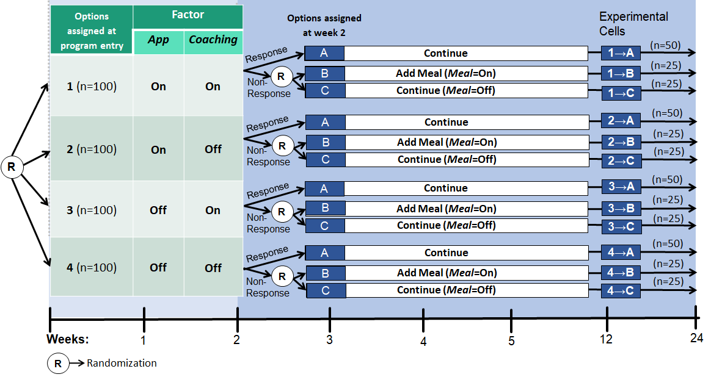
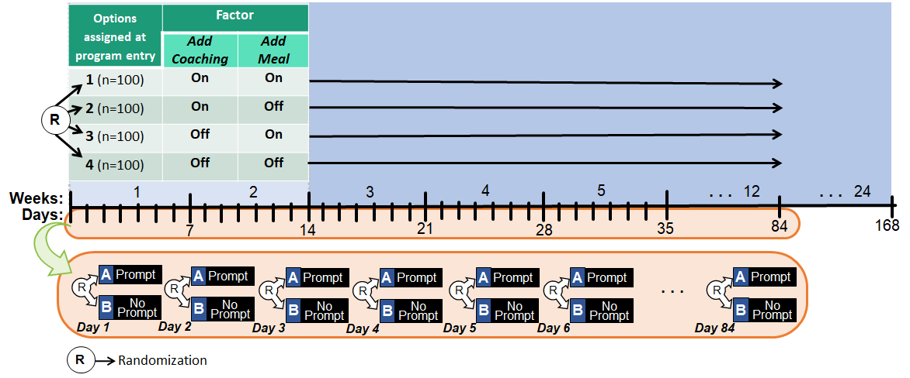
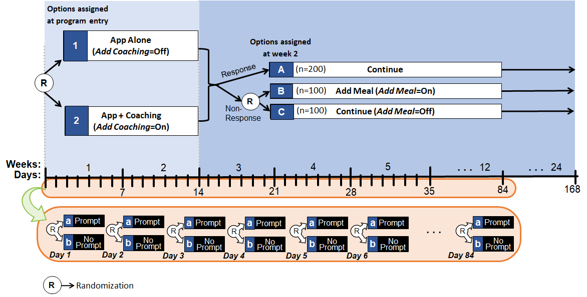

#### On this page, we provide example datasets, analysis code in SAS and R, and outputs, for the three kinds of [hybrid experimental designs](https://d3c.isr.umich.edu/integration/#hed) considered in this recent paper:

> Nahum-Shani, I., Dziak, J. J., Venera, H., Spring, B., & Dempsey W. (2023). [Design of Experiments with Sequential Randomizations at Multiple Time Scales: The Hybrid Experimental Design](https://link.springer.com/article/10.3758/s13428-023-02119-z). *Behavior Research Methods*, [doi:10.3758/s13428-023-02119-z](https://doi.org/10.3758/s13428-023-02119-z). 

#### Each example is based on a hypothetical study to answer specific questions about how to design potential weight loss interventions that integrate multiple components.  More details on the motivation and interpretation for each example is given in Nahum-Shani et al (2023).  

#### The specific hybrids considered combine:

- a classic factorial experiment with a sequential multiple assignment randomized trial [(SMART)](https://d3c.isr.umich.edu/intervention-designs/adaptive-interventions/#smart),
- a classic factorial experiment with a micro-randomized trial [(MRT)](https://d3c.isr.umich.edu/mobilehealth/#mrt), or 
- a SMART with an MRT.

*** 

# Hybrid Factorial-SMART

In the example of hybrid factorial-SMART, the hypothetical intervention being considered would begin by providing a mobile app (*App*) and/or weekly coaching (*Coaching*).  Participants who show early signs of nonresponse after 2 weeks would be offered meal replacement (*Meal*).  The research questions are 

- To achieve maximum weight loss at month 6, is it better to initially offer *App* and/or *Coaching*?
- For nonresponders, is it beneficial (in terms of weight loss at month 6) to add *Meal*?

The first question is addressed by a 2*2 factorial randomization in the initial randomization stage.  The second question is addressed by a second-stage random assignment of nonresponders to 'stay the course' or to additionally add meal replacement. The resulting design is a hybrid factorial-SMART, illustrated in the figure below.




### Downloads

The links below allow you to download the simulated data, and code to analyze it in [R](https://www.r-project.org/) and [SAS](https://www.sas.com/en_us/home.html).

- [Simulated Data](Simulated_Data_Hybrid_Factorial_SMART.csv)

- [Analysis Code for SAS](Analyze_Simulated_Data_Hybrid_Factorial_SMART.sas)

- [Sample Output from SAS](factorial-smart-results.pdf)

- [Analysis Code for R](Analyze_Simulated_Data_Hybrid_Factorial_SMART.R)

### Sample Output from R

Below is part of the output generated from the R analysis code, using the 
[geeglm function from the publicly available geepack R package](https://cran.r-project.org/web/packages/geepack/geepack.pdf)
to solve the weighted and replicated estimating equations
used in analyzing the simulated data from the design (see Nahum-Shani et al., 2023, for details). The output below shows the fitted coefficients for a model predicting the final outcome from all of the experimental factors and two baseline covariates.

```
Call:geeglm(formula = final_kg_lost ~ is_female + baseline_bmi_centered + 
    app * coaching * meal, data = data_for_analysis, weights = replicate_weight, 
    id = ID, corstr = "independence")

 Coefficients:
                      Estimate  Std.err    Wald Pr(>|W|)    
(Intercept)            2.22928  0.11300 389.197  < 2e-16 ***
is_female              0.09250  0.11293   0.671  0.41273    
baseline_bmi_centered -0.06860  0.03363   4.161  0.04137 *  
app                    0.11394  0.10753   1.123  0.28930    
coaching               0.71485  0.10740  44.304 2.81e-11 ***
meal                   0.92702  0.08558 117.322  < 2e-16 ***
app:coaching           0.10818  0.10749   1.013  0.31424    
app:meal              -0.01785  0.08570   0.043  0.83501    
coaching:meal          0.27742  0.08524  10.592  0.00114 ** 
app:coaching:meal      0.11796  0.08547   1.905  0.16754    
---
Signif. codes:  0 ‘***’ 0.001 ‘**’ 0.01 ‘*’ 0.05 ‘.’ 0.1 ‘ ’ 1

Correlation structure = independence 
Estimated Scale Parameters:

            Estimate Std.err
(Intercept)    4.902  0.3208
Number of clusters:   400  Maximum cluster size: 2 
```
 
The output provides information to help answer the scientific questions.
The output provides some useful tests and estimates.

- There is a statistically significant beneficial main effect of the *Coaching* factor (p<.001).  Because the factor was effect-coded, with yes represented as +1 and no as -1, the main effect (average final outcome difference between the yes and no levels) is twice the regression coefficient. Thus, the main effect of *Coaching* is two times 0.7145, or about 1.4 more kilograms lost.  The *App* factor does not have a statistically significant main effect (p=.2893) so there is no credible evidence that the app is beneficial on average. There also doesn't seem to be a significant interaction between *Coaching* and *App* (p=.3142), so we can make decisions based on their main effects alone.  It looks like there is justification for beginning the intervention with Coaching, but not necessarily with App.

- The *Meal* factor for nonresponders has a statistically significant main effect (p<.001).  The main effect is twice 0.9270, or about 1.8 kilograms, which may be clinically significant. There is also a beneficial interaction (possible synergy) between *Coaching* and *Meal* (p=0.00114).

Biological sex (coded +1 for female and -1 for male), and baseline BMI, also centered at 0, are  included as covariates in the example analysis. This is done mainly to account for extra error variance, and their coefficients do not directly address  the main research questions.  Nonetheless, higher BMI seems to be associated with lower weight loss (p<.001), although sex does not seem to matter.

Of course, this is simulated data from a hypothetical study, so the 'results' reported here should not be considered for making real-world conclusions.  They are only provided as a template for planning, analyzing and interpreting future real studies.  Also, note that this example does not contain information on costs, which would also be an issue in judging the practical significance and scalability of the observed effect, especially because meal replacement can be expensive; cost-effectiveness would be a separate analysis.

***
 
# Hybrid Factorial-MRT
         
For the hybrid factorial-MRT example, the intervention being considered is now slightly different. It would initially offer a supportive app that can be used to record dietary intake, and it might also offer coaching sessions (*Coaching*) and/or meal replacement (*Meal*) along with the app.  Either or both of these would be offered at the beginning of the study and continue throughout the study, and meal replacement would not be limited to nonresponders as before. As before, the researcher wants to know whether either or both of these factors would have an effect on the final (distal) outcome of weight loss after six months.

However, now during the course of the study, a mobile phone text prompt or push notification (*Prompt*) might be given on some days at noon, reminding the participant to monitor food intake.  The researcher wants to know whether this prompt improves the short-term goal or 'proximal outcome' of dietary self-monitoring that day. Thus there are separate questions, requiring separate analyses, for the  distal outcome at the participant level and the proximal outcomes at the observation level within participant. 

The researcher wants to investigate the following questions:

- Are either or both of *Coaching* and *Meal*   effective, in terms of improving the  'distal outcome' of weight loss after six months?
- Is *Prompt* effective, on the day when it is given, in improving the proximal outcome, i.e., the  probability that the participant will engage with dietary tracking that day?



### Downloads

The simulated data and analysis code can be downloaded from the links below.

- [Simulated Occasion-Level Data](Simulated_Data_Hybrid_Factorial_MRT_occasion_level.csv)

- [Simulated Person-Level Data](Simulated_Data_Hybrid_Factorial_MRT_person_level.csv)

- [Analysis Code for R](Analyze_Simulated_Data_Hybrid_Factorial_MRT.R)

- [Analysis Code for SAS](Analyze_Simulated_Data_Hybrid_Factorial_MRT.sas)

- [Sample Output from SAS](factorial-mrt-results.pdf) 

###  Sample Output from R

It is necessary here  to fit separate models for the distal and the proximal outcomes. The distal outcome is observed on the person level; it happens once per person. In contrast, the proximal outcome happens once per day per person.

#### Distal:

Sample output from the distal (person-level) analysis is shown below.

```

Call:
lm(formula = final_kg_lost ~ is_female + baseline_bmi_centered + 
    coaching * meal, data = person_level)

Residuals:
   Min     1Q Median     3Q    Max 
-7.011 -1.682 -0.178  1.598  9.616 

Coefficients:
                      Estimate Std. Error t value Pr(>|t|)    
(Intercept)             2.5651     0.1344   19.08  < 2e-16 ***
is_female              -0.0289     0.1349   -0.21   0.8306    
baseline_bmi_centered  -0.1962     0.0389   -5.04  7.2e-07 ***
coaching                0.2053     0.1237    1.66   0.0978 .  
meal                    0.3308     0.1235    2.68   0.0077 ** 
coaching:meal           0.0330     0.1236    0.27   0.7897    
---
Signif. codes:  0 ‘***’ 0.001 ‘**’ 0.01 ‘*’ 0.05 ‘.’ 0.1 ‘ ’ 1

Residual standard error: 2.47 on 394 degrees of freedom
Multiple R-squared:  0.0837,	Adjusted R-squared:  0.0721 
F-statistic:  7.2 on 5 and 394 DF,  p-value: 1.82e-06
```

The meal replacement factor (*Meal*) has a statistically significant effect on the distal outcome (p=.0077).  Its effect size is twice 0.33, or .66 kilograms.  If this is considered high enough to be worthwhile, it would support a decision to start an adaptive intervention with Meal.  The *Coaching* factor does not seem to have a statistically or practically significant effect, and there does not seem to be a significant interaction.

#### Proximal:
```
Call:
geeglm(formula = proximal_outcome ~ is_female + baseline_bmi_centered + 
    A * coaching * meal, family = binomial(link = log), data = occasion_level, 
    id = ID, corstr = "independence")

 Coefficients:
                      Estimate  Std.err    Wald Pr(>|W|)    
(Intercept)           -0.50615  0.00526 9262.21  < 2e-16 ***
is_female              0.01383  0.00527    6.88   0.0087 ** 
baseline_bmi_centered -0.00451  0.00147    9.35   0.0022 ** 
A                      0.00707  0.00439    2.59   0.1073    
coaching               0.02136  0.00477   20.02  7.6e-06 ***
meal                   0.02523  0.00475   28.20  1.1e-07 ***
A:coaching             0.00927  0.00439    4.46   0.0346 *  
A:meal                 0.00287  0.00439    0.43   0.5131    
coaching:meal          0.00723  0.00476    2.31   0.1284    
A:coaching:meal        0.00632  0.00439    2.07   0.1501    
---
Signif. codes:  0 ‘***’ 0.001 ‘**’ 0.01 ‘*’ 0.05 ‘.’ 0.1 ‘ ’ 1

Correlation structure = independence 
Estimated Scale Parameters:

            Estimate Std.err
(Intercept)        1 0.00285
Number of clusters:   400  Maximum cluster size: 84 
```

In the output above, A represents the prompt factor.  It does not seem to have a statistically significant effect on the proximal outcome (p=.1073).  Perhaps participants are ignoring the prompt.  The coaching and meal factors do have an effect on the proximal outcome as well as the distal outcome; however, because they are long-term decisions, the distal outcome is probably more important to consider.  There may be a significant interaction between the prompt and the *Coaching* factor (p=.0346), in which the prompt is more effective if the participant has a coach. However, because the coaching factor doesn't seem to have an effect on the distal outcome, the interaction might not be enough to support including either the prompts or the coaching.

We don't test the effect of an individual occasion-level prompt (e.g., on a particular day) on the distal outcome, because that would likely be too small to detect.  The hypothetical study isn't designed for comparing prompts versus no prompts at all on the distal outcome, because in this hypothetical design everyone got prompts about half the days; the main difference was which days.  So whether prompts are ever helpful in this intervention for this population is still unknown.  They do not at least seem to affect the proximal outcome  much. 


***

# Hybrid SMART-MRT

In the example hybrid SMART-MRT, the intervention being considered will begin with a mobile app to facilitate dietary self-monitoring, but the researcher wonders whether it might be beneficial to augment this by adding in-person coaching (*Coaching*), in terms of improving the distal outcome of six-month weight loss.  For nonresponders to the initial intervention, as assessed after 2 weeks, the researcher also wants to know whether it might be beneficial to add meal replacement (*Meal*), in terms of improving the distal outcome.  Also, the researcher wants to know whether it is beneficial on a given day to give a mobile text prompt (*Prompt*) encouraging self-monitoring, in terms of improving the proximal outcome of engagement with the self-monitoring app that day.



### Downloads

The simulated data and analysis code can be downloaded from the links below.

- [Simulated Occasion-Level Data](Simulated_Data_Hybrid_SMART_MRT_occasion_level.csv)

- [Simulated Person-Level Data](Simulated_Data_Hybrid_SMART_MRT_person_level.csv)

- [Analysis Code for SAS](Analyze_Simulated_Data_Hybrid_SMART_MRT.sas)

- [Sample Output from SAS](smart-mrt-results.pdf) 

- [Analysis Code for R](Analyze_Simulated_Data_Hybrid_SMART_MRT.R)

### Sample Output from R

Again, we need to fit separate models for the distal and the proximal outcome. The output looks very similar to the factorial-MRT example, which is not surprising because a SMART is a special kind of factorial design. The difference from the factorial-MRT is that now the analysis for the SMART part of the design here takes into account the fact that only nonresponders, not everyone, were randomized to a level of the *meal* factor. 

#### Distal
```
Call:
geeglm(formula = final_kg_lost ~ is_female + baseline_bmi_centered + 
    coaching * meal, family = gaussian, data = person_level_data_for_analysis, 
    weights = replicate_weight, id = ID)

 Coefficients:
                      Estimate Std.err   Wald Pr(>|W|)    
(Intercept)             1.9457  0.1404 191.98   <2e-16 ***
is_female               0.2629  0.1403   3.51    0.061 .  
baseline_bmi_centered  -0.0366  0.0382   0.92    0.338    
coaching                0.6638  0.1276  27.07    2e-07 ***
meal                    0.1065  0.0907   1.38    0.240    
coaching:meal           0.0276  0.0908   0.09    0.761    
---
Signif. codes:  0 ‘***’ 0.001 ‘**’ 0.01 ‘*’ 0.05 ‘.’ 0.1 ‘ ’ 1

Correlation structure = independence 
Estimated Scale Parameters:

            Estimate Std.err
(Intercept)     6.38   0.469
Number of clusters:   400  Maximum cluster size: 2 
```

Coaching has a strongly statistically significant main effect (p<.001), 
representing twice .66 or about 1.3 kilograms lost.  Thus, it may be 
considered worthwhile if resources allow. The meal replacement program did not
have a statistically significant effect in this hypothetical trial (p=.240),
so it would probably not be considered worth the additional expense. The
two factors did not significantly interact.

The ``cluster size'' above is given as 2, which might seem confusing because the outcome is supposed to be person-level. This happens because the estimation is done using a weighting and replication method (W&R), which treats people who were not randomized to a level of the Stage II factor as if they were clusters of two people: one who was randomized to +1 and one to -1 on that factor. The true sample size without replicates is taken into account in the standard error. This is explained further [in a 2012 *Psychological Methods* article](https://www.ncbi.nlm.nih.gov/pmc/articles/PMC3825557/).


#### Proximal
```
Call:
geeglm(formula = proximal_outcome ~ is_female + baseline_bmi_centered + 
    A * coaching * meal, family = binomial(link = log), data = occasion_level_data_for_analysis, 
    weights = replicate_weight, id = ID)

 Coefficients:
                       Estimate   Std.err    Wald Pr(>|W|)    
(Intercept)           -0.507430  0.005606 8194.45   <2e-16 ***
is_female              0.017033  0.005738    8.81    0.003 ** 
baseline_bmi_centered -0.000685  0.001514    0.20    0.651    
A                      0.007566  0.004641    2.66    0.103    
coaching               0.034190  0.004899   48.70    3e-12 ***
meal                   0.004951  0.003495    2.01    0.157    
A:coaching             0.010098  0.004641    4.73    0.030 *  
A:meal                 0.004567  0.003289    1.93    0.165    
coaching:meal          0.005349  0.003494    2.34    0.126    
A:coaching:meal       -0.000912  0.003290    0.08    0.782    
---
Signif. codes:  0 ‘***’ 0.001 ‘**’ 0.01 ‘*’ 0.05 ‘.’ 0.1 ‘ ’ 1

Correlation structure = independence 
Estimated Scale Parameters:

            Estimate Std.err
(Intercept)        1 0.00283
Number of clusters:   400  Maximum cluster size: 168 
```

The prompts factor (*A*) again does not have a statistically significant main effect (p=.103). 
It does have a significant and positive interaction with coaching, however (p=0.030), on top of the already strong effect of coaching.  Therefore, if coaching is being provided, then prompts may also be useful. 

Coaching also has a strongly significant average effect on the proximal outcome. However,  coaching is randomized at the participant level instead of every day separately, so we will pay more attention to  its distal effect, which was already seen to be statistically significant. That is because the proximal effect of coaching is not the ultimate question of the study; it is at most a hypothesized  mediator by which coaching contributes to the distal outcome, which represents the final goal. As before, we do not test the effect of any particular daily prompt on the distal outcome, because there are many days in the study and the effect of the prompt given on a single day would not be feasible to detect.


***

# Further Information

### What resources does this page provide?

This page provides links to simulated datasets, sample analysis code, and output for three novel kinds of experimental designs for use in informing the development of [multimodal adaptive interventions](https://d3c.isr.umich.edu/integration/#madi).

### How can an intervention scientist use the resources on this page?

This information may be useful in helping researchers to conceptualize the kinds of questions that each design can address, and in providing a partial template for the analysis of data from those designs.  

### See also:

- [A more advanced example analysis](https://github.com/d3center-isr/hybrid-experimental-design) for a hybrid SMART-MRT in which only nonresponders received the micro-randomized treatments. This example is analyzed using a robust method which allows the use of time-varying covariates.
 
- [Open-access preprint of the *Behavior Research Methods* article](https://arxiv.org/abs/2302.09046)
 
- [A closely related article with more information](https://journals.sagepub.com/doi/pdf/10.1177/25152459221114279)
